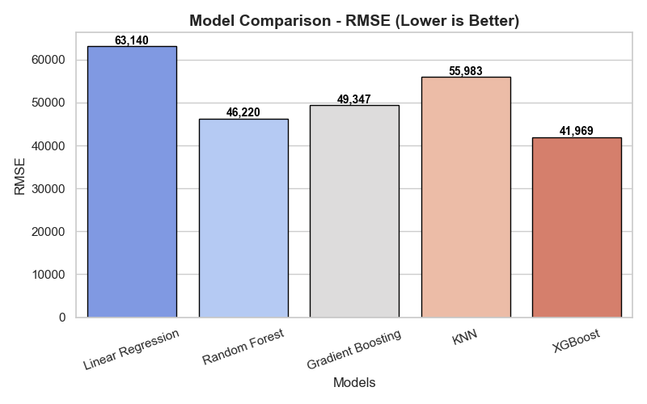

# 🏠 California House Pricing Prediction
## 📌 Project Overview

The California housing market is diverse and influenced by many factors such as `income levels`, `location`, `population`, `number of rooms`, and `proximity to the ocean`. Predicting housing prices here is challenging because the values fluctuate with multiple interdependent variables. Buyers, sellers, and policymakers often need reliable price predictions to make informed decisions.

In this project, we addressed the problem of predicting median house values in California using machine learning. The dataset provided detailed information about demographics, income, housing conditions, and geographic factors. After cleaning and preprocessing the data, we engineered new features, handled categorical variables, and compared several regression models. Among them, the XGBoost Regressor performed best, achieving an R² score of ~0.82.

This project demonstrates how data-driven approaches can effectively capture the patterns in real estate markets. The insights can support real estate professionals, investors, and researchers in understanding key drivers of house pricing and in building predictive tools for future housing trends.

## 📂 Dataset

* Columns:
`longitude`, `latitude`, `housing_median_age`,`total_rooms`, `total_bedrooms`,
`population`, `households`, `median_income`, `median_house_value` **(target)**, `ocean_proximity` _(categorical)_, 

* Size: ~20640 _Rows_, & 10 _columns_

* Source: [Download Dataset form here.](https://www.kaggle.com/datasets/codelabpluse/californial-housing-dataset)

## 🛠️ Steps Performed

**1. Data Cleaning:**
- Checked duplicates & null values

- Handled missing values in bedrooms_per_room

- One-Hot Encoding for ocean_proximity

**2. Exploratory Data Analysis:**

- Histograms & Distribution plots

- Correlation heatmap

**3. Feature engineering:**
- rooms_per_household, 

- population_per_household, 

- bedrooms_per_room

**4. Feature Scaling:**

- StandardScaler applied to numerical features

- Model Training

- Linear Regression

- Random Forest Regressor

- Gradient Boosting

- Decision Tree

- Ridge, Lasso

- KNN

- XGBoost

## 📊 Results
```
RandomForest Regressor: RMSE ~ 46,220, R² ~ 0.77

Linear Regression: RMSE ~ 63,140, R² ~ 0.58

Gradient Boosting: RMSE ~ 49,347, R² ~ 0.74

KNN: RMSE ~ 55,983, R² ~ 0.67

XGBoost (Best Model): RMSE ~ 41,969, R² ~ 0.82
```

## 📊 Model Performance
<p align="center">
  
  
</p>


## ✅ Final chosen model: _XGBoost Regressor_

**🚀 Tech Stack:**

- Python

- Pandas, 
- NumPy

- Matplotlib, 

- Seaborn

- Scikit-learn

- XGBoost

## 📌 How to Run

**1. Clone the repository:**

```
git clone https://github.com/pradip-pawar1/california_house_pricing.git
```

**2. Install dependencies:**
```
pip install -r requirements.txt
```

**3. Run the notebook / script:***
```
jupyter notebook
```

## 📈 Future Improvements

- Hyperparameter tuning for XGBoost

- Try ensemble stacking

- Deploy as a web app using Flask